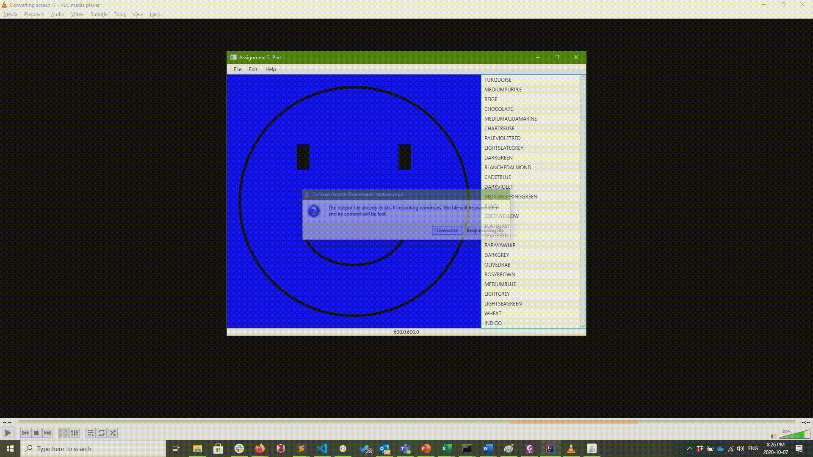
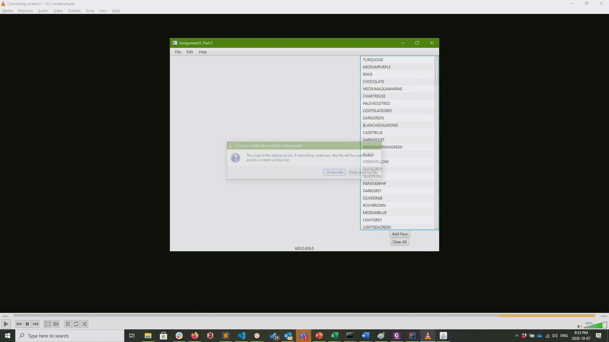

# Assignment 3

### Due Friday, Oct. 16 @ 11:55pm

## Part 1 - Creating a Widget that draws itself

### General Requirements

In part 1, you will create an interface that displays a typical looking interface. 

- In the main part of the screen you will display a Happy Face that fills up all available space. 
- On the right-hand side is a ListView that displays a list of colors, clicking a color selects the color of the face.   
- The top of the window displays a menu bar with items (but it doesn't do anything).
- Bottom bar displays the dimensions of the Happy Face in pixels (width, height)



### Implementation Requirements and Details

- To layout the elements of the interface you must use FXML (i.e., you should not create any interface component (i.e., container or control) using code, you must use FXML)
- You can use code to add behaviour to your elements. You will need to access elements (like the ListView or the HappyFaceDisplay widget through the containment hierarchy once it is loaded), see below: 

```java
    BorderPane root = FXMLLoader.load(getClass().getResource("Interface.fxml"));

    //get components
    HappyFaceDisplay happyFace = (HappyFaceDisplay) root.getCenter();
```

- The label that displays the dimensions of the HappyFaceDisplay widget should be centered. To connect the bottom label with the details of the contract you can create a binding between the properties:

```java
label.textProperty().bind(Bindings.concat(object.someProperty(),",",object.someOtherProperty());
```

- The MenuBar, should have three menus, each with at least one item each. The menu does not need to have any functionality (i.e., nothing needs to happen when you click "File->Save"). Try using the SceneBuilder with your FXML file to make this easy. 
- The HappyFaceDisplay extends the Pane class. Use a canvas to draw the face.
- The HappyFaceDisplay should display a happy face that scales appropriately with the size of the space it is given, and everything remains perfectly centered. Provide some padding around the edges of the face. Scale the size of the strokes in the face (make them thicker when the face is bigger, and thinner when it is smaller). 
- Your HappyFaceDisplay property should implement the property pattern (with appropriate accessors and mutators) for a Color property.
- To update the drawing of the face automatically, override the layoutChildren method in the pane as follows:

```Java
 @Override
public void layoutChildren() {
    canvas.setWidth(this.getWidth());
    canvas.setHeight(this.getHeight());
    drawHappyFace(); // a method that you write
}
```

- Remember that the parent container will set the size (width and height) of its children based on its algorithm and the child's size properties (i.e., prefWidth, prefHeight, minHeight, maxWidth, etc.)
- You should initialize the HappyFaceDisplay as 600 pixels wide by 600 pixels high. You can do this by using ```setPrefWidth and setPrefHeight```.
- You can easily change the color property of the HappyFaceDisplay by adding a listener on the ListView

```Java
 lv.getSelectionModel().selectedItemProperty().addListener(
    (observable, oldValue, newValue) -> {
        //update the face's color                    
    }
);
```

- You have been provided the ```Utility.ColorUtility``` to assist with populating the list view and finding a Color object based on a color name

### Recommended order of implementation

- You could start by completing the ```Interface.fxml``` file to layout the structure of the interface.
- You can then complete your HappyFaceDisplay widget
- Finally, you can add behaviour to the Labels and ListView in your main class as needed.

## Part 2 - Creating your own layout pane

### General Requirements
In part 2, you will extend the code you have already created in part 1, and create your own layout pane that has a simple layout algorithm.

- You will create a MyFlowPane that extends the Pane class. It displays components starting from the top left and corner, placing items corner to corner, down and to the right. You will replace the large HappyFaceDisplay with an empty MyFlowPane.
- You will add additional buttons under the ListView to add a new face in the currently selected color, or to clear all faces that have been added.
- You will update your HappyFaceDisplay so that it smiles when its size is between its maxSize dimensions and its prefSize, has a straight face when its size is between the prefSize to its minSize, and a frown when it is at is minSize or smaller.
- Part 2 adds one additional class, for the MyFlowPane, which extends Pane. It is important to remember that the Pane class is a fixed layout class, but you will make it behave like a stack layout type widget similar to an HBox (but with a slightly different layout algorithm).



### Implementation Requirements and Details

- MyFlowPane extends Pane and provides an overriden LayoutChildren method. This method is where the layout algorithm is implemented.
- The algorithm is as follows:
    - Determine add up the dimensions of all children for prefWidth, perfHeight, maxWidth, maxHeight, minWidth, minHeight
    - If maxWidth <= the MyFlowPane's Width, then set every child's size to their maxWidth and maxHeight, place each node at the bottom right-and corner of the last child
    - Else if prefWidth <= MyFlowPane's, then set every child's size to their prefWidth and prefHeight, place each node at the bottom right-hand corner of the last child
    - Else, set every child's size to their minWidth and minHeight, place each node at the bottom right-hand corner of the last child
- Here is some code to get you started:

```Java
    @Override
    public void layoutChildren() {
        // first determine the size parameters for all children 
        // by looping through and adding them up 
        for (int i = 0; i < getChildren().size(); i++) { 
            Region r = (Region) getChildren().get(i);
            prefHeight += r.getPrefHeight();
            //...
        }
    
        //next size the children as appropriate
        //use max dimensions if there is enough space horizontal space
        if (maxWidth <= this.getWidth())
        {       
            //...
        }
        
        //etc as described above
}
```

- The MyFlowPane, like other Pane's should clip any Node that is not within it's bounds (i.e., it should not display parts of the node that aren't inside the MyFlowPane). However, the Pane class (unlike other Pane classes does not do this by default). So, you will need to add this behaviour by adding the following code to the MyFlowPane constructor:

```Java
//add in clipping to the pane
Rectangle clipRectangle = new Rectangle();
this.setClip(clipRectangle);
this.layoutBoundsProperty().addListener((observable, oldValue, newValue) -> {
    clipRectangle.setWidth(newValue.getWidth());
    clipRectangle.setHeight(newValue.getHeight());
});
```
- You will need to update the label at the bottom of the window to display the dimensions of the MyFlowPane, since there will be HappyFaceDisplays
- When a HappyDisplayFace is added to the MyFlowPane it will be given random dimension details. In all cases the width and height will be the same, as follows:
    - The maxWidth/Height will be between 250 and 500 pixels
    - The prefWidth/Height will be between 100 and 200 pixels, and
    - The minWidth/Height will be between 10 and 80 pixels
- To implement the smiling, straight, or frowning space. You need only update the HappyFaceDisplay's drawing of the mouth. Check max,pref,min Width against the width it currently has set.    

### Recommended order of implementation
- Start by implementing the MyFlowPane.
- You can then update your other classes by copying in code from Part 1.
- Update your Interface.fxml to have the correct components.
- Update the behaviour of your buttons and label, including the random sizing of the HappyFaceDisplays.
- Finally, update the HappyFaceDisplay to redraw its smile based on its size.
